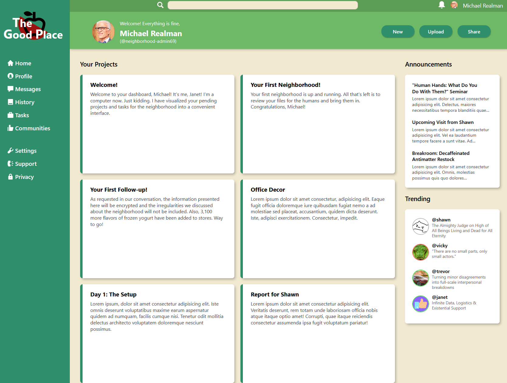

# Grid Dashboard Project
A fun dashboard webpage themed around the work of particular afterlife architect. Done as part of the Intermediate HTML and CSS course of the Odin Project.

## Description

The purpose of this page was to practice and explore CSS grid. Grids and nested grids are the primary structuring methods used to organize each part of the dashboard. Building in this way showcases both the strengths and limitations of using grid as opposed to building entirely with flex.

The dashboard cards are responsive and fill the screen space accordingly. Parts of the page use responsive scaling. Media queries would be necessary to further adjust elements, but this is beyond the scope of the project.